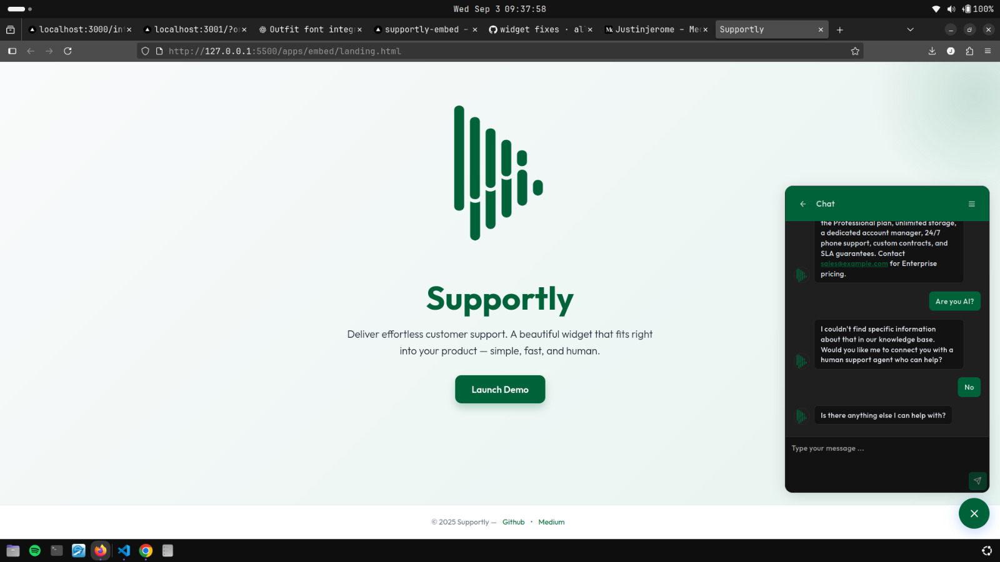
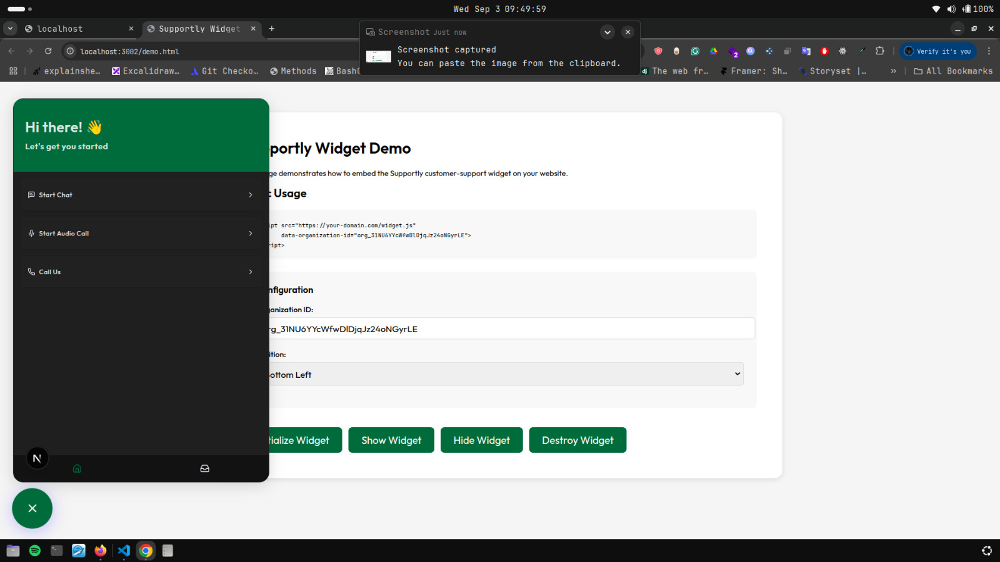
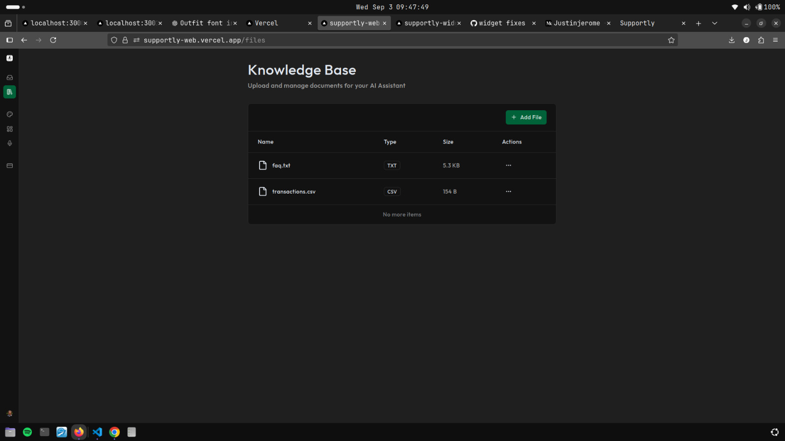
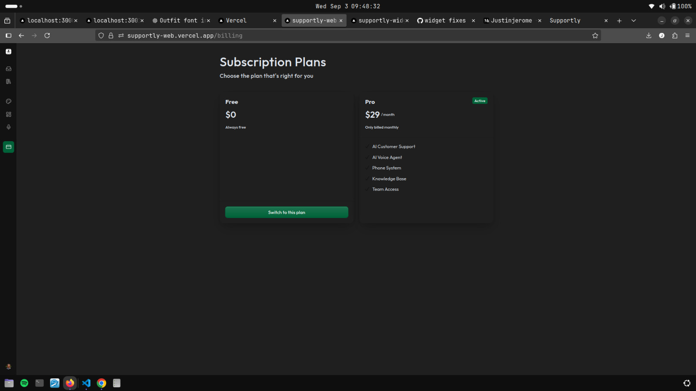
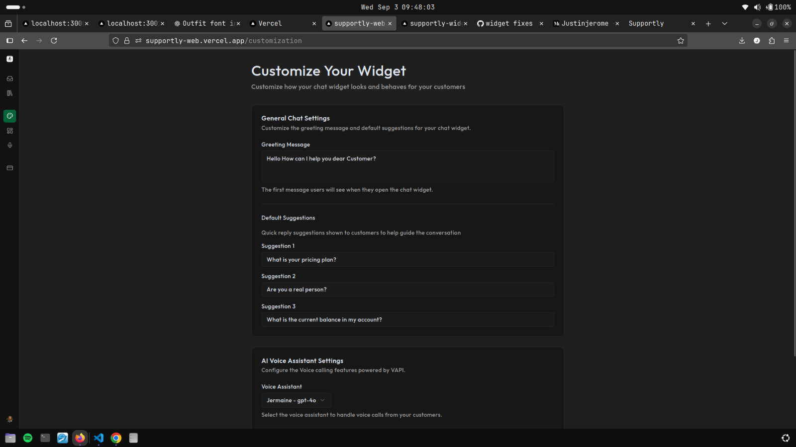

# 🧠 Supportly — AI-Powered Customer Support Platform

Supportly is a production-ready, full-stack AI customer support SaaS built with Next.js and React. It features real-time AI chat, voice support, smart knowledge base with RAG, human handoff logic, multi-tenant workspaces, authentication, billing, and a developer-friendly embeddable widget.

🚀 Live Demo for the Tenant side: https://supportly-web.vercel.app

🚀 Live Demo for the Browser Client side: https://supportly-web.vercel.app

---

## 📸 Screenshots

### A Demo Landing Page  


### Client Chat Widget  


### Customize your Widget


### 🗨️ Tenant Conversations View  


### 📚 Knowledge Base UI  


### 💳 Tenant Billing  


### 🛠 Tenant Customization  



---

## 🧩 Features

- 🤖 **Real-time AI Chat** using Convex Agents  
- 🔊 **Voice Support** via VAPI for real-time voice interaction  
- 🧠 **Smart Knowledge Base** with uploaded docs + embeddings + RAG  
- 📣 **Human Handoff & Auto-Close** logic to route conversations  
- 👥 **Multi-Tenant Workspaces & Team Management**  
- 🔐 **Authentication & Billing** using Clerk  
- 🔑 **Secure API Key Storage** with AWS Secrets Manager  
- 🛠️ **Embeddable Developer Chat Widget**  
- 📈 **Operator Dashboard** for managing conversations  
- 🧰 **Developer Toolkit** for easy embed/script setup  
- 🧠 **AI Model Support** — OpenAI, Anthropic, Grok

---

## 🚀 Tech Stack

- **Framework:** Next.js 15  
- **Frontend:** React 19, Tailwind CSS v4  
- **Backend & Data:** Convex Agents, Embeddings & RAG  
- **Authentication & Billing:** Clerk  
- **Voice API:** VAPI  
- **Error Tracking:** Sentry  
- **Monorepo:** Turborepo  
- **UI Components:** shadcn/ui

---

## 🛠️ Installation

1. Clone the repo

```bash
git clone https://github.com/all-black-493/supportly.git
cd supportly
```

2. Install dependencies

```bash
pnpm install
```

## ⚙️ Configuration

Create a .env.local file in the root directory and add your environment variables:

```bash
NEXT_PUBLIC_CONVEX_URL=your_convex_url
VAPI_API_KEY=your_vapi_key
AWS_SECRET_ACCESS_KEY=your_aws_secret
CLERK_JWT_KEY=your_clerk_jwt_key
SENTRY_DSN=your_sentry_dsn
# …other required variables
```

Replace placeholder values with actual API keys/secrets before running.

## 📦 Usage

🧪 Run in Development

```bash
pnpm dev
```

Visit:

```bash
http://localhost:3000
```

Use sample tenant/admin accounts or create your own with the in‑app signup.

